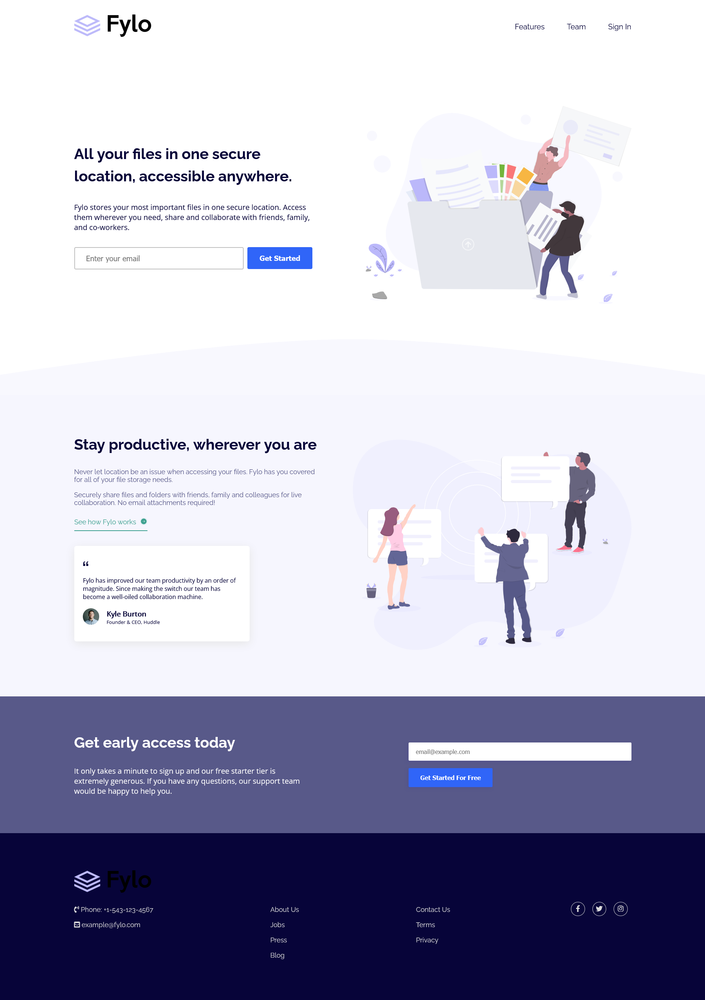

# Frontend Mentor - Fylo landing page with two column layout solution

This is a solution to the [Fylo landing page with two column layout challenge on Frontend Mentor](https://www.frontendmentor.io/challenges/fylo-landing-page-with-two-column-layout-5ca5ef041e82137ec91a50f5). Frontend Mentor challenges help you improve your coding skills by building realistic projects. 

## Table of contents

- [Frontend Mentor - Fylo landing page with two column layout solution](#frontend-mentor---fylo-landing-page-with-two-column-layout-solution)
  - [Table of contents](#table-of-contents)
  - [Overview](#overview)
    - [The challenge](#the-challenge)
    - [Screenshot](#screenshot)
    - [Links](#links)
  - [My process](#my-process)
    - [Built with](#built-with)
    - [What I learned](#what-i-learned)
  - [Author](#author)

## Overview

### The challenge

Users should be able to:

- View the optimal layout for the site depending on their device's screen size
- See hover states for all interactive elements on the page

### Screenshot

### Links

- Solution URL: [Solution URL](https://github.com/Rohitgour03/Fylo-landing-page-with-two-column-layout/)
- Live Site URL: [Live Solution](https://rohitgour03.github.io/Fylo-landing-page-with-two-column-layout/)

## My process

### Built with

- Semantic HTML5 markup
- CSS custom properties
- Flexbox

### What I learned

In this challenge i learned to layout things using css and also placing images as a background image.

## Author

- Website - [Rohit gour](https://www.your-site.com)
- Frontend Mentor - [@Rohitgour03](https://www.frontendmentor.io/profile/Rohitgour03)
- Twitter - [@Rohitgour03](https://www.twitter.com/Rohitgour03)

